# 소통,

## 프로젝트 소개

 "소통, " 어플은 사용자가 자신의 생각이나 감정을 원하는 이미지 위에 써서 하나의 카드를 만들어 사람들과 소통하는 어플입니다.
 
 사용자는 관심있는 키워드와 관련된 내용의 게시글만 모아 볼 수 있고, 같은 관심사를 가진 사람들과 댓글카드를 통해 소통할 수 있습니다.
 

## 개발환경

* 프론트 - 안드로이드
* 서버 - 스프링부트 http://github.com/shin-ga-eun/Sotong-Server
* 데이터베이스 -  MYSQL
* 기타 라이브러리
  - Retrofit2: 프론트와 서버의 http통신 지원 라이브러리
  - Glide: 안드로이드 이미지로딩 라이브러리

 ## 실행화면
 
 * 회원가입
 
 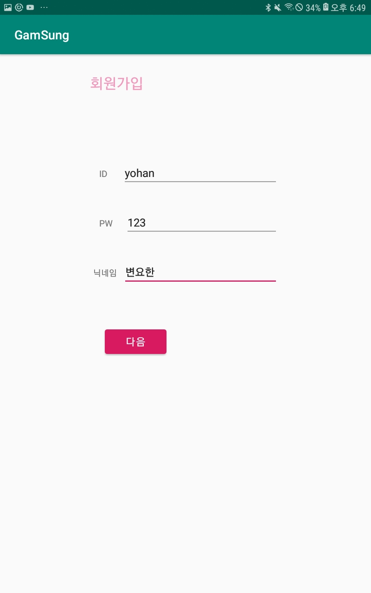
 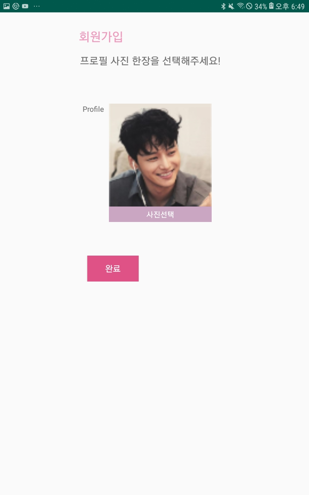
 
 * 로그인
 
 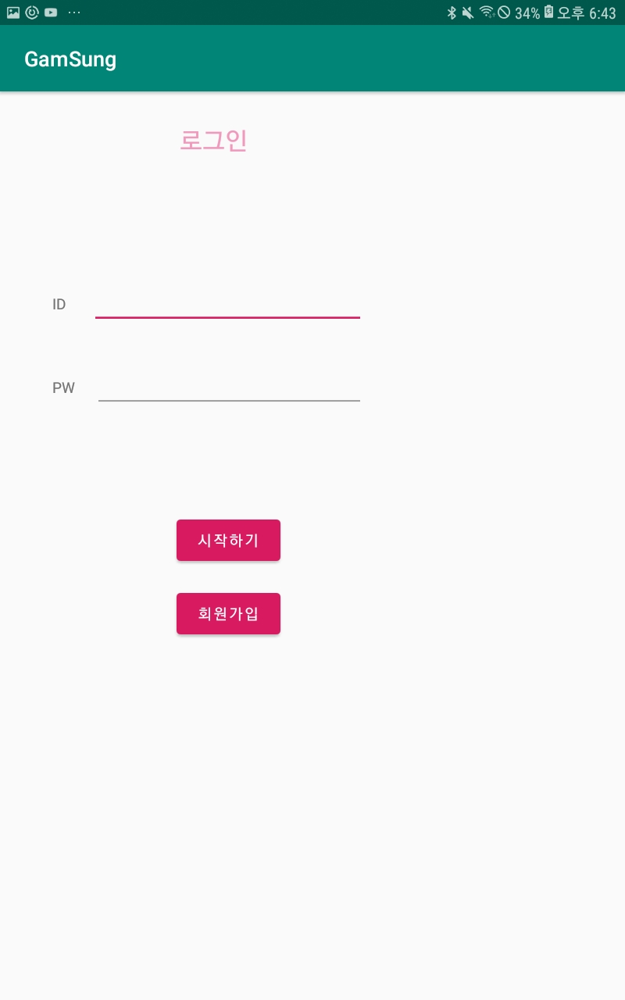
 
 * 메인홈
 
 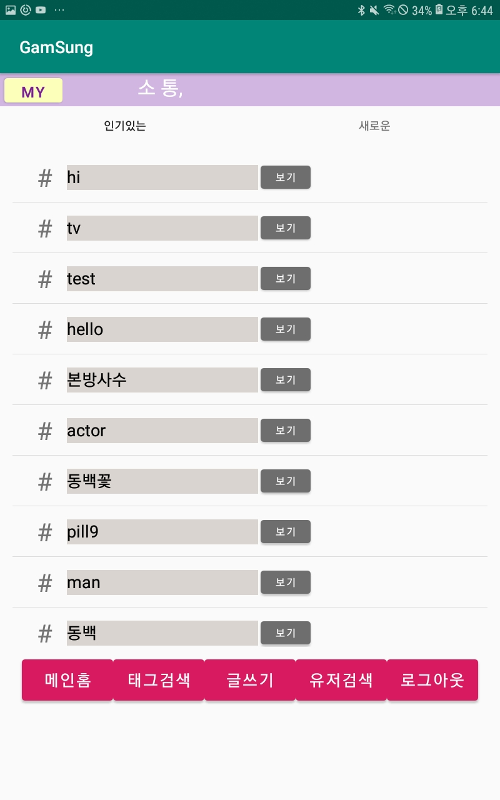
 
 * 태그검색
 
 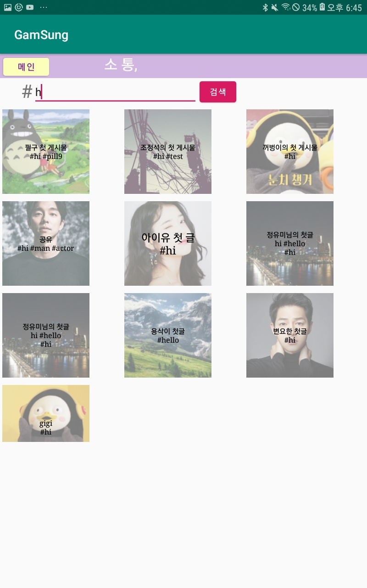
 
 * 유저검색
 
 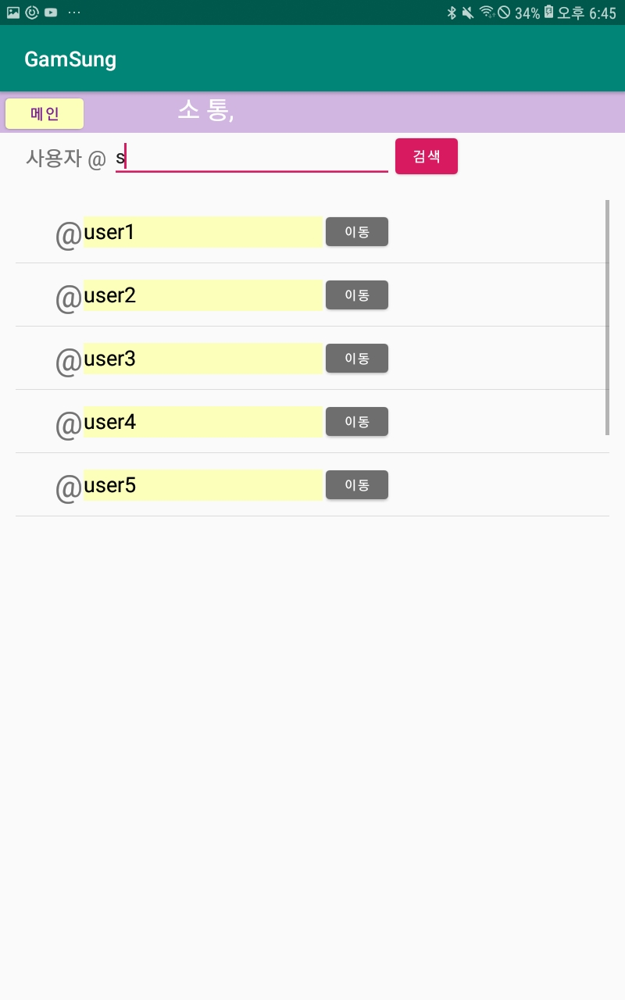
 
 * 카드 리스트 출력
 
 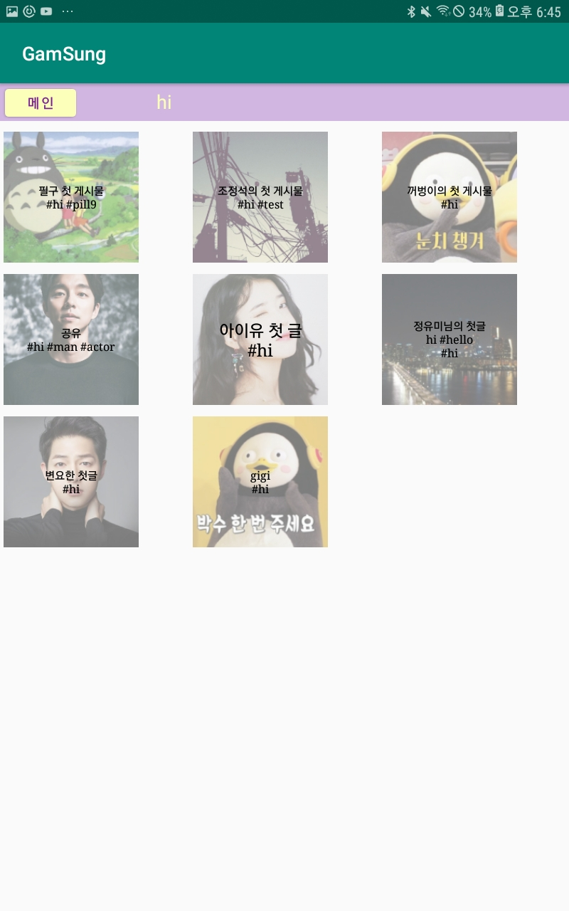
 
 * 카드 상세보기
 
 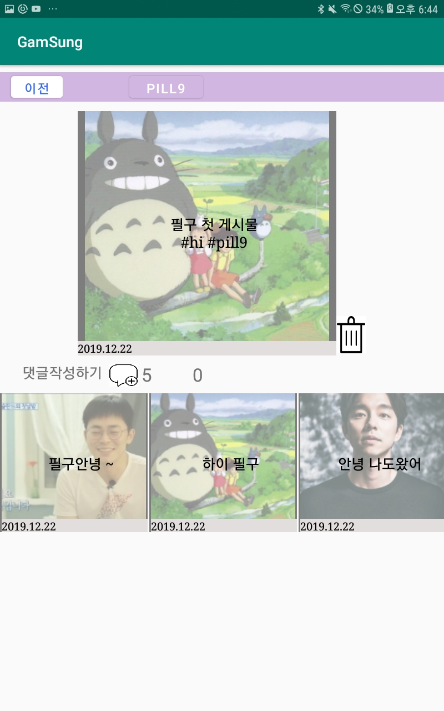
 
 * 마이프로필
 
 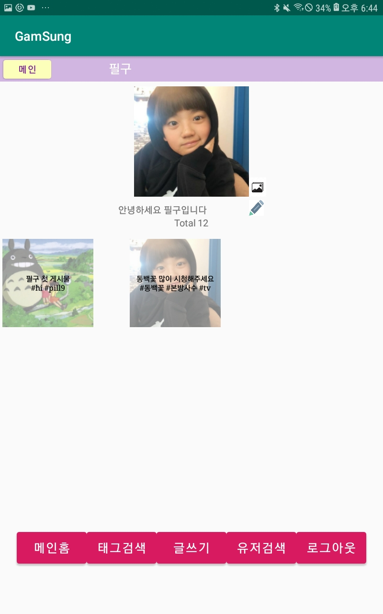
 
 * 카드작성
 
 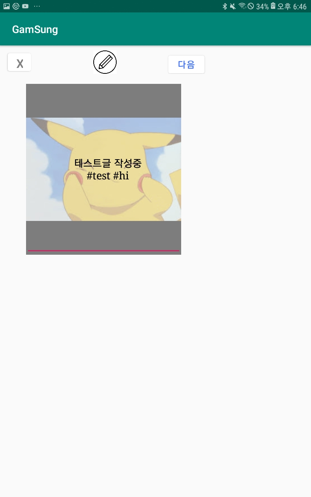
 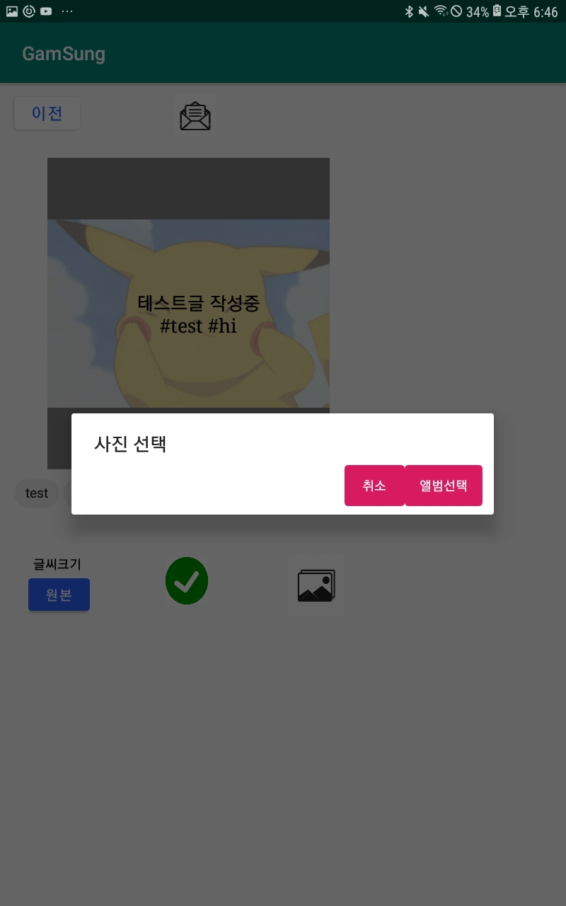
 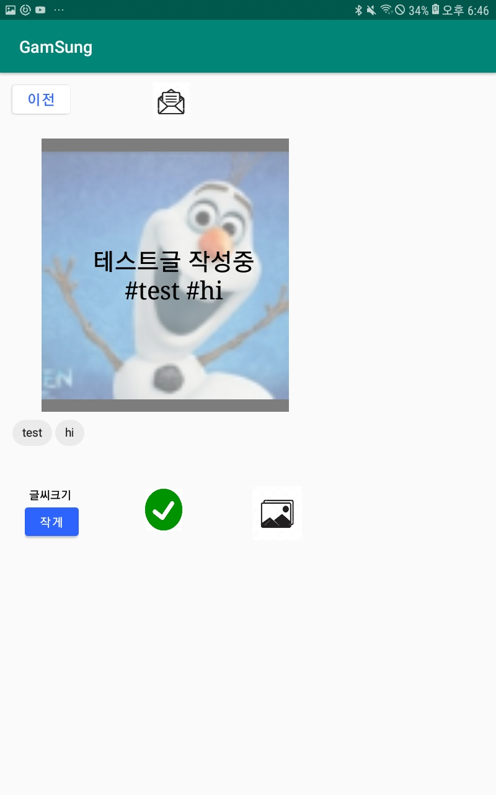
